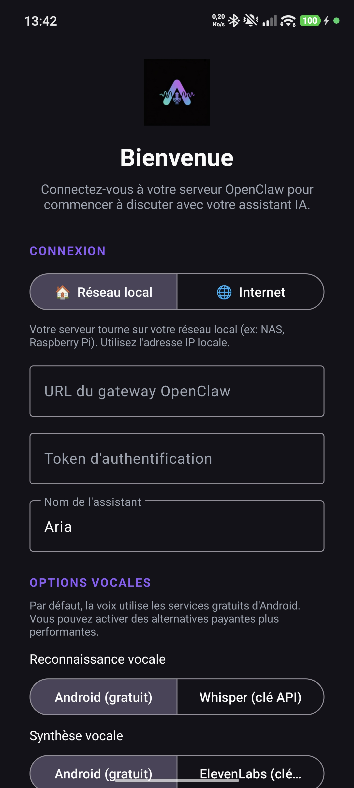
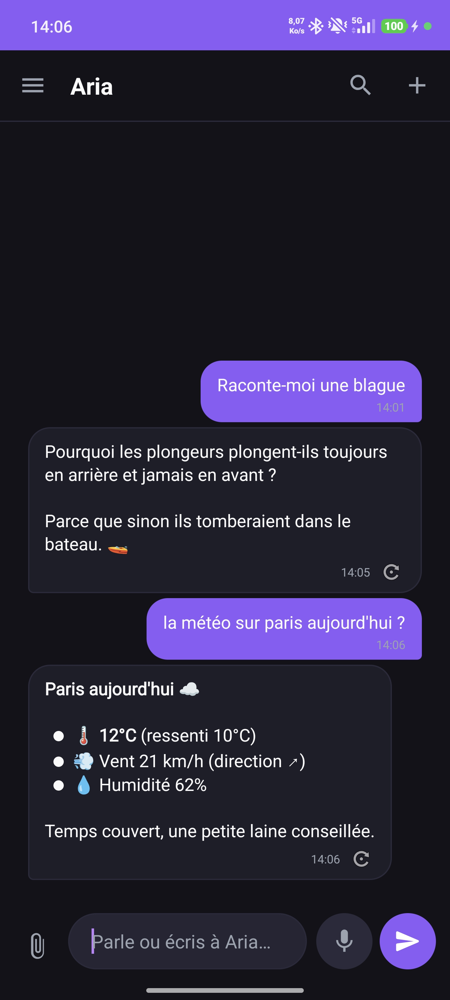
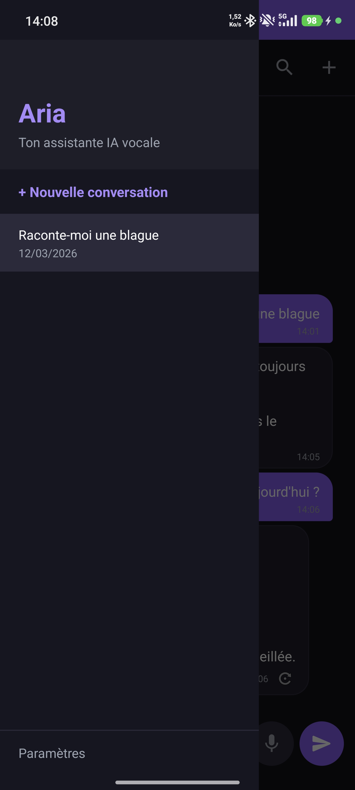

# Aria – OpenClaw Chat Client

[](https://github.com/Pattex67/aria-openclaw-android/releases/latest)

Native Android client for [OpenClaw Gateway](https://github.com/openclaw/openclaw). Connects via native WebSocket. Supports voice input, file attachments, and shared sessions.

## Screenshots

<p float="left">
  
  
  
</p>

## What is OpenClaw?

OpenClaw is an open-source AI gateway server that you self-host on your own hardware (NAS, Raspberry Pi, VPS, etc.). It acts as a bridge between your AI provider (OpenAI, Google Gemini, Mistral, etc.) and multiple clients — Discord bots, web interfaces, and mobile apps like Aria.

This app **requires** a running [OpenClaw Gateway](https://github.com/openclaw/openclaw) instance to connect to. It does not call AI APIs directly — all requests go through your OpenClaw server, which manages sessions, memory, and multi-client synchronization.

## Installation

1. Download the latest APK from [GitHub Releases](https://github.com/Pattex67/aria-openclaw-android/releases/latest)
2. Enable "Install from unknown sources" on your Android device
3. Install and launch the APK
4. Enter your server URL, auth token, and session key (`agent:main`)

## Configuration

| Parameter   | Description                                  | Example                          |
|-------------|----------------------------------------------|----------------------------------|
| Gateway URL | URL of your OpenClaw server (see below)      | `http://192.168.1.x:18789`       |
| Auth Token  | Authentication token for the gateway         | *(set in your server config)*    |
| Session Key | Session identifier to join a shared session  | `agent:main`                     |

### Local network (LAN)

If your phone is on the same network as your server, use the local IP directly:

```
http://192.168.1.x:18789
```

### Remote access (Cloudflare Tunnel)

To access your server from outside your network, set up a [Cloudflare Tunnel](https://developers.cloudflare.com/cloudflare-one/connections/connect-networks/) pointing to your gateway port. Then use the tunnel URL:

```
https://your-subdomain.example.com
```

The app automatically upgrades `https://` to `wss://` for WebSocket connections.

## Features

- Real-time chat via WebSocket
- Voice input (speech-to-text)
- Send files and images
- Shared session history with other OpenClaw clients
- Biometric app lock
- Home screen widget
- Backup & restore conversations

## Support the project

[](https://ko-fi.com/pattex67)

## License

This project is licensed under the [MIT License](LICENSE).

---

> This client requires a self-hosted [OpenClaw Gateway](https://github.com/openclaw/openclaw) server.
